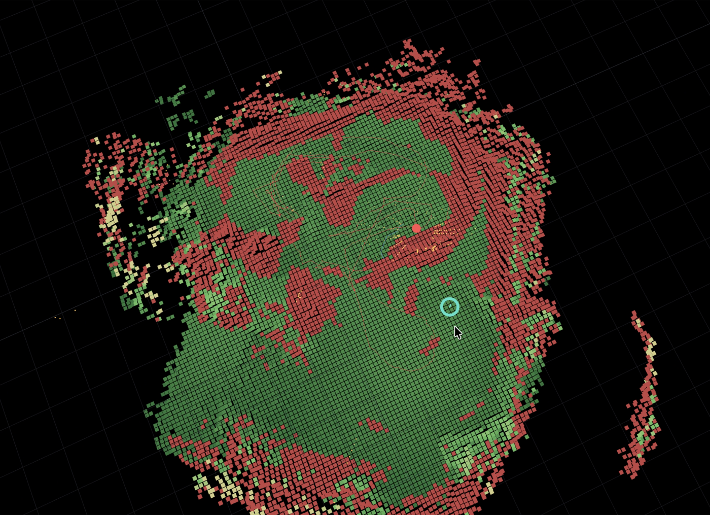

# Lidar Discretization & Path Planning for a Quadruped

Turn a 3D lidar point cloud into a discrete, plannable map and find a traversable
path across it. The discretization is a **2.5D elevation grid** with a
traversability cost layer — the representation legged robots actually use, because
it keeps the step/slope/gap information a flat 2D occupancy grid throws away,
without the cost of a full 3D voxel grid.

```
point cloud (N×3)  ──►  2.5D elevation grid  ──►  traversability cost grid  ──►  A* path
                        (height per cell)         (free / lethal / unknown)
```

## Unitree Go2 demo

[](https://youtu.be/dkycOf34YqI)

The Go2 builds a persistent 2.5D costmap from its live lidar stream, renders
traversable and lethal cells in the browser, and follows continuously replanned
A\* paths toward clicked goals. **Click the preview to watch the demo on
YouTube.**

### Live global costmap



Green tiles are traversable, red tiles are lethal or footprint-inflated, the
red trace is the robot trajectory, and the cyan marker is the clicked goal.

## Quick start

```bash
pip install -r requirements.txt        # numpy + matplotlib only (no scipy/ROS)

python3 demo.py                        # synthetic scene, writes out.png
python3 demo.py --cloud scan.npy --res 0.08 --start 0.5,0.5 --goal 9.5,5.0
python3 tests/test_pipeline.py         # run the test suite (also works under pytest)
```

`demo.py` produces a 3-panel figure: the raw cloud (colored by height), the
elevation grid, and the cost grid with the planned A\* path overlaid.

## Library usage

```python
import numpy as np
from lidar_pathplan import discretize, astar, GridConfig, QuadrupedParams

cloud = np.load("scan.npy")            # (N, 3+) array of x, y, z[, ...]

robot = QuadrupedParams(
    radius=0.30,        # footprint radius; obstacles are inflated by this
    max_step=0.18,      # tallest step the robot can climb
    max_slope_deg=30.0, # steepest traversable slope
    max_roughness=0.05, # tolerable within-cell height std
)
grid = discretize(cloud, GridConfig(resolution=0.10), robot)

start = grid.world_to_cell(0.5, 0.5)   # meters -> (row, col)
goal  = grid.world_to_cell(9.5, 5.0)
path  = astar(grid.cost, start, goal)  # list of (row, col), or None
xy    = [grid.cell_to_world(r, c) for r, c in path]   # back to meters
```

## How the discretization works

1. **Binning** — every point is dropped into an XY cell by its `(x, y)`.
2. **Per-cell statistics** — count, mean height, and a sum-of-squares are
   accumulated in a single vectorized pass (`np.add.at` over a flat cell index),
   so it scales to millions of points.
3. **Geometry layers**
   - `elevation` — mean ground height per cell (`NaN` where no returns landed).
   - `roughness` — within-cell height **standard deviation** (robust to a stray
     return and to point density, unlike raw max−min).
   - `slope` — gradient magnitude of the (lightly smoothed) elevation surface,
     computed **NaN-aware** so cells next to map holes / the border aren't
     poisoned by invented values.
   - `step` — max height difference to the 4-neighbours, to catch curbs and edges.
4. **Classification** — each observed cell is `FREE`, `LETHAL`, or `UNKNOWN`.
   A cell is lethal if it exceeds the robot's `max_step`, `max_slope`, or
   `max_roughness`. Then:
   - **speckle removal** drops lethal connected-components smaller than
     `min_obstacle_cells` (sensor noise), *without* thinning real obstacles, and
   - **inflation** dilates the cleaned obstacle mask by the footprint radius so
     the planner keeps body clearance.
5. **Cost** — `1 + roughness/slope penalties`, with `inf` at lethal cells and a
   configurable cost for unknown cells.

## Planner

`astar` runs 8-connected A\* over the `cost` grid with an octile (admissible)
heuristic. Entering a cell costs the average of the two cells' costs times the
step distance, so the path prefers flat, smooth ground and routes around
obstacles. Diagonal corner-cutting between two blocked cells is forbidden.

## Tuning for your robot / sensor

| Symptom | Knob |
|---|---|
| Too many obstacles on flat ground | raise `QuadrupedParams.max_roughness`, increase `GridConfig.resolution` |
| Robot clips obstacle corners | raise `QuadrupedParams.radius` |
| Small steps wrongly blocked | raise `max_step` |
| Speckle obstacles survive | raise `GridConfig.min_obstacle_cells` |
| Planner avoids unobserved space | lower `GridConfig.unknown_cost`, or set `cost_unknown_as_free=True` |
| Won't enter unknown space at all | treat unknown as lethal in your own post-step |

## Supported input formats

`load_point_cloud` (in `lidar_pathplan.io_utils`) reads `.npy`, KITTI-style
`.bin` (float32 x,y,z,intensity), ASCII `.pcd`, `.ply` (ascii or binary
little/big endian, with arbitrary extra vertex properties), and
`.xyz`/`.txt`/`.csv`. All inputs are expected in a fixed world/odom frame;
columns 0,1,2 are x,y,z.

## Testing on real data

Two ready-to-run harnesses under `examples/` download a real scan and run the
full pipeline (they save a 3-panel figure: scan, elevation grid, classification +
A\* path):

```bash
python3 examples/test_real_kitti.py    # automotive Velodyne scan (outdoor, clean lidar)
python3 examples/test_real_room.py     # indoor RGBD room fragment (Open3D), for an indoor quadruped
```

Real data exposed things the synthetic scene did not — worth knowing if you bring
your own clouds:

- **Up-axis is not always z.** RGBD/SLAM clouds are often not gravity-aligned. The
  room harness auto-detects the vertical axis (the one whose height histogram has
  the sharpest peak — the flat floor) and remaps so the floor is at height 0.
- **Thresholds are sensor-specific.** Clean lidar (KITTI) works with the default
  `QuadrupedParams`. A single-view RGBD floor has ~0.15–0.2 m of depth scatter per
  cell at grazing angles, so it needs looser `max_roughness`/`max_slope` and more
  `GridConfig.smooth_passes` (the room harness defaults reflect this). With lidar
  defaults the pipeline correctly — but unhelpfully — flags the noisy floor as
  low-confidence. Tune to your sensor's noise, not just your robot.
- **`smooth_passes`** (new `GridConfig` knob) controls how much the elevation
  surface is denoised before slope/step are computed: 1 for clean lidar, 3–5 for
  noisy reconstruction.

## Using it with nav2 (ROS2 Foxy or newer)

This repo is also a ROS2 ament_python package (`lidar_nav2`). The node
`costmap_node` subscribes to a `PointCloud2`, runs `discretize()`, and republishes
the result as a `nav_msgs/OccupancyGrid` that nav2 consumes as a costmap layer.

**How it plugs in:** the grid enters nav2 through a `StaticLayer` (exactly like a
map_server map), and nav2's `InflationLayer` inflates it against the robot
footprint. The node therefore publishes *without* its own footprint inflation
(`inflate_obstacles=False`) so clearance isn't applied twice. The soft
slope/roughness costs are preserved by setting `trinary_costmap: false` on the
StaticLayer, so the planner still prefers flat, smooth ground.

```
PointCloud2  ──►  costmap_node  ──►  /lidar_costmap (OccupancyGrid)  ──►  nav2 StaticLayer + InflationLayer
```

Build and run (Ubuntu 20.04 / Foxy — matches the Go2 — or 22.04 / Humble):

```bash
# place this repo at  <ws>/src/lidar_nav2  then:
cd <ws>
colcon build --packages-select lidar_nav2
source install/setup.bash

ros2 launch lidar_nav2 lidar_costmap.launch.py \
    input_topic:=/velodyne_points target_frame:=odom resolution:=0.10
```

Then merge `config/nav2_costmap_params.yaml` into your `nav2_params.yaml` (it
configures `global_costmap`/`local_costmap` to read `/lidar_costmap`) and bring up
nav2 normally. Set the costmap `resolution`, `global_frame`, and `footprint` to
match the node's `resolution`/`target_frame` and your robot.

Node parameters (with defaults) are documented at the top of
`lidar_nav2/costmap_node.py` — topics, frame, resolution, `map_size`, z-clip, the
robot mobility limits, `unknown_cost`, and `publish_period` (rate limit).

**Frames:** the node assumes incoming points are already in `target_frame` (e.g.
`odom`). If your lidar driver publishes in a sensor frame, transform the cloud
upstream (tf2 + `do_transform_cloud`) before this node.

## Paper method: classical navigation stack (Kalman map → Dijkstra → TEB → APF)

An additive implementation of the stack from Wang et al., *"Research on path
planning of quadruped robot based on globally mapping localization"* (IEEE), under
`lidar_pathplan/paper_method/`. It reuses the 2.5D geometry above and adds the
paper's four classical blocks:

```
Kalman terrain map  ─►  Dijkstra global path  ─►  elastic-band (TEB) smooth  ─►  APF local avoidance
```

```bash
python3 examples/paper_navigation_demo.py              # full fixed-goal stack
python3 examples/paper_navigation_demo.py --mode follow # person-following (moving goal)
python3 tests/test_paper_method.py                     # 11 tests
```

- **`KalmanElevationMap`** — probabilistic 2.5D map. Each cell holds a height *and
  variance*; successive scans are fused with a 1-D Kalman filter (measurement
  noise grows with range), so repeated observations drive variance down and
  average out sensor noise — the paper's headline. `predict(q)` adds process noise
  so the map stays adaptive. `to_grid()` emits a traversability cost grid using the
  paper's grid-height-difference obstacle test plus a variance gate (still-noisy
  cells fall back to UNKNOWN).
- **`dijkstra`** — uniform-cost global planner (A\* with zero heuristic; a test
  asserts it returns the same-cost path as `astar`).
- **`smooth_path`** — elastic-band geometric smoother: a simplified stand-in for
  full TEB (geometry/clearance only, no time-optimal kinodynamics).
- **`APFPlanner`** — Khatib artificial potential field: attractive goal + repulsive
  obstacles via a chamfer distance field. `follow_path()` tracks the Dijkstra path
  with a carrot sub-goal (this is the paper's two-level design — APF alone traps in
  local minima at large obstacles, which is *why* a global planner is needed).
  `run(start, goal)` accepts a **moving goal** `t -> (x, y)` for **person-following**
  — the modern extension where the robot has no fixed destination, only the person.

The `--mode follow` demo routes a "person" along a guaranteed-free Dijkstra path at
walking speed and has the robot APF-track them (~0.5 m gap) while avoiding hazards.

> Not implemented: the paper's SLAM/ICP **localization** block — poses are assumed
> known and passed to `map.update(points, sensor_origin)`. On a real robot, plug in
> your SLAM (e.g. LIO/ICP) to supply those poses.

## Real-time onboard navigation (deploy to the robot)

`lidar_nav2/realtime_nav_node.py` is the deployable navigator: the **start is
always the dog's own position** (from odometry) and the **goal is a world
coordinate** — preprogrammed waypoints or sent at runtime (e.g. RViz "2D Goal
Pose"). Every scan rebuilds a robot-centric local traversability grid and the
path is **replanned continuously**, so the robot routes around obstacles as the
lidar discovers them.

```
/points (PointCloud2) ─┐
/odom  (Odometry) ─────┼─► realtime_nav ─► /cmd_vel (Twist)
/goal_pose (PoseStamped)┘        │
                                 ├─► /planned_path  (Path, for RViz)
                                 └─► /local_costmap (OccupancyGrid, for RViz)
```

```bash
# on the robot (ROS2 Foxy), e.g. Unitree Go2-style topics:
ros2 launch lidar_nav2 realtime_nav.launch.py \
    input_topic:=/utlidar/cloud_deskewed odom_topic:=/utlidar/robot_odom \
    waypoints:="[5.0, 0.0, 5.0, 5.0]" max_speed:=0.4

# or send a goal at runtime:
ros2 topic pub -1 /goal_pose geometry_msgs/PoseStamped \
    "{header: {frame_id: odom}, pose: {position: {x: 5.0, y: 2.0}}}"
```

Design (all in the ROS-free core `lidar_nav2/navigator_core.py`, so it is fully
unit-tested off-robot in `tests/test_navigator_core.py`):

- **Rolling window** — the grid is a fixed-size square centered on the robot,
  so compute stays bounded (~19 ms per scan→grid→replan cycle at 8 m / 0.10 m);
  a goal beyond the window is projected onto its edge (rolling-horizon).
- **Unknown space is untraversable** (conservative onboard default): the dog is
  never commanded into space the lidar hasn't seen. If the goal isn't reachable
  in the current map, it plans to the reachable cell nearest the goal, so it
  drives to the frontier and new scans open the way.
- **Safety stops** — commanded velocity is zero whenever the newest scan is
  older than `scan_timeout` or no path exists.
- **Carrot follower** — heading-error controller with a lookahead point;
  rotates in place first when the heading error is large. Output is a body-frame
  `Twist` (`linear.x`, `angular.z`) that quadruped walk controllers accept.

**Robot-specific wiring:** the cloud must be in the same frame as the odometry
(`odom_frame`); if your driver publishes in the base frame, set
`cloud_in_odom_frame:=false` and the node transforms points with the odom pose.
For the **Unitree Go2**, `lidar_nav2/go2_twist_bridge.py` converts `/cmd_vel`
into Sport-API `Move` requests (with a stop watchdog and a dry-run mode) —
**see [deploy/DEPLOYMENT.md](deploy/DEPLOYMENT.md) for the full step-by-step
lab runbook**: computer setup, DDS connection, frame verification, motion-disabled
dry run, first live walk, and tuning.

## Files

| File | Purpose |
|---|---|
| `lidar_pathplan/elevation_grid.py` | point cloud → 2.5D elevation + cost grid; `cost_to_occupancy` |
| `lidar_pathplan/astar.py` | A\* planner over the cost grid |
| `lidar_pathplan/robot.py` | quadruped mobility parameters |
| `lidar_pathplan/io_utils.py` | point cloud loaders |
| `lidar_pathplan/synthetic.py` | synthetic test scene generator |
| `demo.py` | end-to-end CLI demo + visualization (synthetic scene) |
| `examples/test_real_kitti.py` | run on a real KITTI Velodyne scan (auto-download) |
| `examples/test_real_room.py` | run on a real indoor RGBD room scan (auto-download) |
| `lidar_pathplan/paper_method/` | Kalman map, Dijkstra, elastic-band/TEB, APF |
| `examples/paper_navigation_demo.py` | paper stack demo (`stack` and `follow` modes) |
| `tests/test_pipeline.py`, `tests/test_paper_method.py` | test suites (10 + 11) |
| `lidar_nav2/costmap_node.py` | ROS2 node: PointCloud2 → OccupancyGrid for nav2 |
| `lidar_nav2/navigator_core.py` | ROS-free real-time navigator (rolling map, replan, follower) |
| `lidar_nav2/realtime_nav_node.py` | ROS2 node: onboard real-time navigation → `/cmd_vel` |
| `launch/realtime_nav.launch.py` | launch file for the onboard navigator |
| `tests/test_navigator_core.py` | simulated end-to-end navigation tests |
| `config/nav2_costmap_params.yaml` | nav2 costmap config consuming the grid |
| `launch/lidar_costmap.launch.py` | launch file for the node |
| `package.xml`, `setup.py` | ROS2 ament_python package metadata |

## Notes / extensions

- **Frames**: this assumes points are already in a stable frame. On a real robot,
  transform raw scans into `odom`/`map` (via TF) before discretizing.
- **Real-time / ROS2 / nav2**: done — see the nav2 section above. The core stays
  plain numpy; the `lidar_nav2` node is a thin rclpy wrapper, and A\* is replaced
  by nav2's planner once the grid is a costmap layer.
- **Beyond A\***: the cost grid drops into any grid planner (Dijkstra, Theta\*,
  D\* Lite for replanning). For footstep-level planning, feed `elevation` +
  `classes` to a footstep planner instead of treating the body as a disk.
